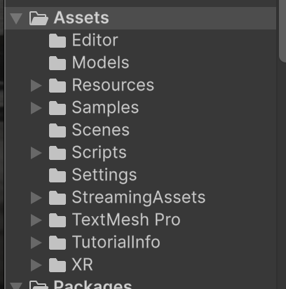
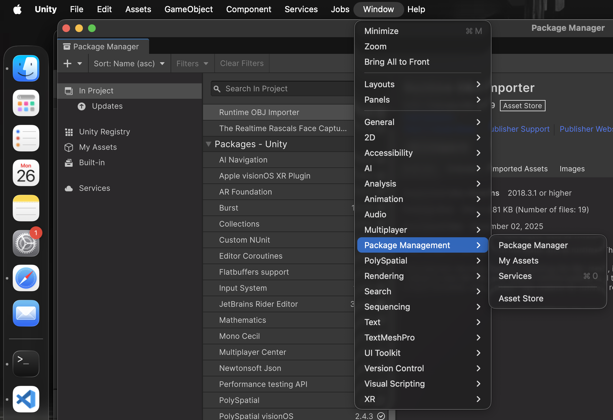
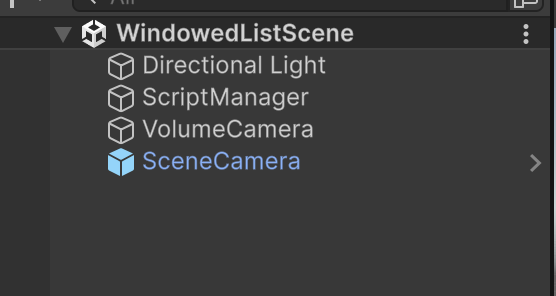
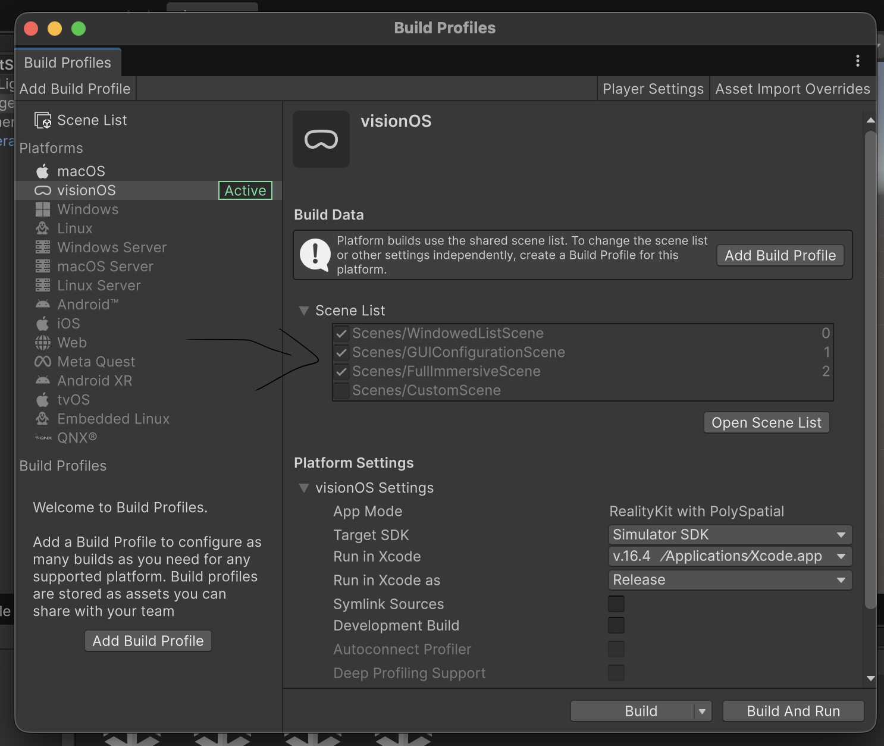
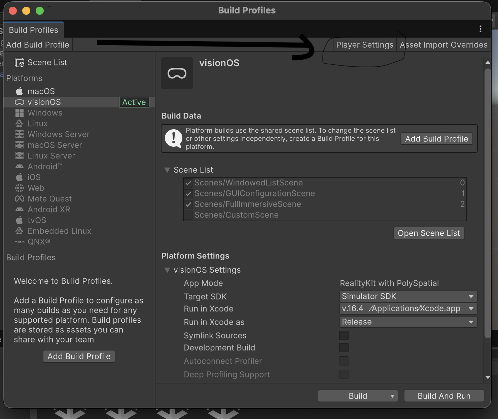

# In General

## Folder Structure

### 1. on Unity

- Model OBJ yang diproses Unity, ada di ./Resources.
- Model USDZ yang diproses visionOS, ada di ./StreamingAssets (bawaan default biar kebaca visionOS).
- Gizmo dan prefabs lainnya juga di ./Resources.
- Scripting C# Unity semua di folder ./Scripts/Scripts
- Kode Swift semua di folder ./Scripts/SwiftAppSupport
- Scenes semua di ./Scenes. Dengan 3 main Scene, dengan urutan
  - WindowedListScene (Bagian antarmuka awal pemilihan kasus uji)
  - GUIConfigurationScene (Bagian antarmuka kedua, pemilihan sisi model) 
  - FullImmersiveScene (Bagian utama, planning)
- Sisanya utils & backup

### 2. on Code. yang penting
#### a.Bagian Komunikasi
1. Define function untuk callback & send command ke swift, itu di file Assets/Samples/PolySpatial/Shared/Scripts/SwiftUISamplePlugin.swift. 
2. Function tersebut dipakai di driver untuk setiap scene, di folder Assets/Scripts/Scripts/Driver. Setiap scene mempunyai driver masing-masing.

#### b.Define Scene
1. Untuk define scene di visionOS nya, itu di file Assets/Scripts/SwiftAppSupport/SwiftUISampleInjectedScene.swift.

## Package yang dipakai
cara cek package on Mac.  
window -> package management -> package Manager.  

### 1. OpenFracture
### 2. PolySpatial
### 3. XR Plugin Management
### 4. Apple visionOS XR Plugin

## Penjelasan Hierachy Scene
Hierachy untuk setiap scene itu sama, terdiri atas 4.   

- Directional light: untuk input lighting ke environment biasak
- ScriptManager: buat masukin semua scene yang bakal dipakai di scene tersebut
- VolumeCamera: game object yang ngedefine volume dari scene tersebut. Kan di visionOS ada dua, bounded or unbounded volume, nah itu didefine disini. By default unbounded, kalau ga diset
- SceneCamera: game object yang tracking eye input, pengganti main camera kalau di unity biasa.

## Cara Build
videos-> https://youtu.be/Dl2pKxeY-n4
1. Cek Build profiles dahulu (file -> Build Profiles).  
  - Platforms: visionOS
  - Target SDK: simulator SDK(kalau coba ke sims), Device SDK (kalau coba ke physical device).
  - Run in Xcode: liat opsi list, xcode version mu.
  - Run in Xcode as: release aja.

2. Open Scene List, dalam build profiles.  

  - pastiin ketiga scene udah dicentang, dan sesuai urutan.

3. Lalu ke player settings (dalam build profiles).  

  - Pertama ke bagian polyspatial.  
    buat default volume camera window config ke: unbounded.  
    sisanya default
  - Kedua ke bagian XR Plug-in Management.   
    pastiin apple vision kecentang
  - Ketiga ke bagian apple visionOS, opsi child dari XR Plug-in Management
    pastiin app mode ke: RealityKit with PolySpatial
    Reality kit immersion style ke: Full
    Initialize hand tracking on startup : gosah dicentang
    set target frame setup rate on startup: gosah dicentang
    sisanya default

4. Build and run, auto running ke sims jika ke sims.